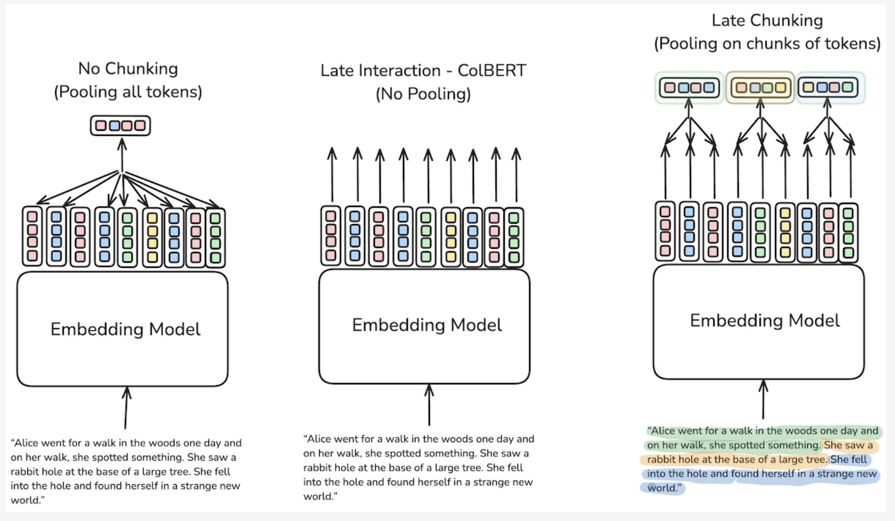

# Chonkie:

## Chefs:

Chefs can be used for the preprocessing of input text. It accepts various text formats and converts the same to the other format as well

1. **TableChef** - Reads file formats like `.csv`, `.xls`, `.xlsx` and converts to the markdown tables
2. **TextChef** - Used to read the `.txt` file and returns `Document` object
3. **MarkdownChef** - Takes markdown files or Strings, extracts tables, code, images and text to group them under the specific categories

```python
from chonkie import MarkdownChef

# Initialize the chef
chef = MarkdownChef()

# Process a markdown file
doc = chef.process("example.md")

# Access the extracted components
print(f"Found {len(doc.tables)} tables") # Groups tables in the markdown under this
print(f"Found {len(doc.code)} code blocks") # Groups Code under this
print(f"Found {len(doc.images)} images") # Groups images under this
print(f"Found {len(doc.chunks)} text chunks") # Groups the text under this
```

## Chunkers:

### Token Chunker:
Splits the text based on the token length, customizable (Can specify the tokenizer or use the already supported tokenizer)
### Sentence Chunker:
Splits the text into the sentence, the delimiters are `default:"['.', '!', '?', '\\n']`
### Recursive Chunker:
Recursively chunks the text, In the first pass it chunks based on the high level delimiter, for each of the chunks it applies the second delimiter to chunk again, like wise recursively chunks the text. There are recipes as well like 
```python
# Initialize the recursive chunker to chunk Markdown
chunker = RecursiveChunker.from_recipe("markdown", lang="en")
```
`RecursiveRules` can be used to configure `RecursiveLevel`, which defines the rule like what delimiters must be used to chunk at the each level of the recursive call
### Table Chunker:
Chunks the markdown table based on the rows and retains the header for each of the chunks
### Code Chunker:
Chunks the code block, can specify the programming language and chunks based on the tokenizer
### Semantic Chunker:
Semantically chunks text, based on the meaning instead of just defined delimiters

1. Splits the text into sentences
2. Computes the embeddings for the each sentence
3. Computes the cosine similarity between adjacent sentence embeddings and records the score. `similarity_window`, controls for how many sentences the similarity should be calculated, lets say 3, then cosine similarity is calculated based on the embedding for the three adjacent embeddings
4. `[0.95, 0.85, 0.80, 0.20, 0.85, 0.88, 0.99, 0.4, 0.99, 0.86]` - lets say this is the recorded cosine similarity, we can see there is a boundary at the index `3`, where the similarity score have dropped
5. Now the chunks can be formed as
Sentence 1 - Topic A 
Sentence 2 - Topic A 
Sentence 3 - Topic A 
Sentence 4 - Topic A 
Chunk-1 (If chunks size fits)
Sentence 5 - Topic B
Sentence 6 - Topic B
Sentence 7 - Topic B 
Sentence 8 - Topic B
Chunk-2 (If Chunk size fits)
Sentence 9 - Topic A
Sentence 10 - Topic A
Sentence 11 - Topic A
Chunk-3 (If chunk size fits)
6. The above chunk-3 can be merge with chunk-1, since they are of the same topic, if we correctly configure `skip_window` parameter, this will merge sentences that are not consecutive but semantically similar. This merging will happen only if they meet the chunk size, else will be split after merge just to fit within the chunk size.
7. Then boundary detection can be made more smooth by configuring parameters like `filter_window`, `filter_polyorder`, `filter_tolerance`, these parameters are based on the **Savitzky-Golay filter boundary detection**

### Neural Chunker:
This is also a semantic chunker, where this uses BERT based transformer model to detect the boundaries. The disadvantage in this is that it doesn't merge the non-consecutive semantically similar sentences which above Semantic Chunker does.

1. Uses models like `mirth/chonky_modernbert_base_1`
2. It tokenizes text that we send using its tokenizer and sends to the model
3. The model outputs 0 or 1 list corresponding to each token, when its 1 then there is boundary there, then text should be split at that as a boundary
[0, 0, 0, 0, 1, 0, 0, 0, 1, 0, 0, 0]
chunk-1 -> tokens 1, 2, 3, 4
chunk-2 -> tokens 5, 6, 7
chunk-3 -> tokens 8, 9, 10, 11

### Late Chunking:


Will present the understanding based on the image with explanation below for each components in the image

#### No Chunking!
This explains how the embedding model works, where each token will have an embedding and these token embedding will be transformed based on the context or tokens that co-occurs in the sentence using attention mechanism. Later based on the transformed or encoded embeddings the final polled single embedding will be generated for the whole text.
#### Late Interaction - ColBERT!
This embedding model (ColBERT) generates token level embeddings, when a text is passed to the ColBERT, output will be matrix where each column is the token embedding. This stays relavent because instead of pooled embedding (Single embedding for the text), this caries more semantic information since there is an embedding for each of the token, this is semantically rich. But has a downside of memory, where this requires more memory to store and more resource for computation. 
How this can be used in RAG?
This can be used for RAG, where each of the knowledge can be chunked and embedded using the ColBERT which is of matrix now, where each token will have its embedding that has be encoded based on the context. This can be stored in the Vector database like Qdrant (Which supports the multi-vector). When the user query comes that is also embedded using ColBERT, even that is matrix, which will have the token level embeddings. Now for the vector similarity, we take each token embedding of the query and find cosine similarity with the each token embedding of each of the knowledge and find the maximum out of it. The same is done for all token of the query with all toekn embeddings for the each of the token embeddings of the knowledge and based on this we can rank based on the highest score. This is expensive, so mostly used for re-ranking after performing normal vector search based on the pooled embeddings.

#### Late Chunking!
Inspired by the Late Interaction, where we use long context embedding model and pass the whole document or a big piece to text. This embedding model will produce the token level embedding. Now based on the chunk_size the document will be broken, later each chunks token level embedding will be pooled (mean, cls, etc.). By this each chunk embedding is going be semantically rich with the context of the whole document.

- [Research Paper](https://arxiv.org/abs/2409.04701)
- [Blog](https://weaviate.io/blog/late-chunking)

### Slumber Chunker:
Where AI agents are used for the chunking, this requires us to provide the LLM and API_KEY for the same, this has the predefined agents that will work based on the LLM that we provide and this is going to perform chunking based on that.

### Other features:
- **Refinery** - This can be used after chunking to configure `overlap`, `Embedding`
- **Handshake** - Can be used to connect Chonkie with the **Vector Database** like Qdrant
- **Porter** - Convert the chunked data into files like JSON or HuggingFace Dataset
- **Pipeline** - Pipeline can be used to orchestrate or tie the above features as a sequence of steps

### References:
- [Chonkie Documentation](https://docs.chonkie.ai/oss/quick-start)

# Chonkie Performance Review:
1. Lightweight, very minimal dependency (0-1),  Python stdlib (Numpy) + (optional) sentence-transformers (except Neural Chunker and Slumber Chunker)
2. Fewer imports, fast loading time
3. Uses Local variables instead of the attribute access
4. Pre-allocated list - When the approximate number of segments are known, capacity is planned accordingly via growth patterns
5. Linear scans (O(n)) - Boundary detection, windowing, and filters are typically single-pass over sentence indices.
6. Precompiled regex
7. In `SemanticChunker` embeddings are calculated as a batch - Batch Inference
8. Cosine similarity is done in NumPy (vectorized) - Very fast because of BLAS/OpenBLAS (CPU) or CuBLAS (GPU) (This will be run in C/Fortran)
9. No framework-style orchestration

### SemanticChunker:
- Cosine similarity matrix is reused
- Savitzky–Golay filter smooths boundaries in O(n)
- Only valley detection is O(n)

### RecursiveChunker:
- Splitting happens linearly (O(n)) with no repeated scans
- Rules are applied top-down, only one pass per level

### SentenceChunker:
- Just regex (extremely fast in CPython)

### TableChef / MarkdownChef:
- Tokenization done once
- Reuses token ids rather than strings